<div align="center">


<a href="https://github.com/fguzman-stack"></a>

<p>
  <a href="https://github.com/fguzman-stack"></a>
  <a href="mailto:familiazv2016@gmail.com"></a>
  <a href="https://miportafolio-fguz.vercel.app/"></a>
</p>

<p>
  <a href="#sobre"></a>
  <a href="#apps"></a>
  <a href="#web"></a>
  <a href="#windows"></a>
  <a href="#colaboraciones"></a>
  <a href="#stack"></a>
  <a href="#seo"></a>
  <a href="#ver"></a>
</p>

</div>


<a name="sobre"></a>
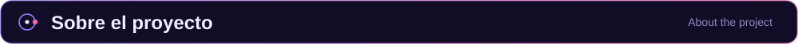

<br />

Portafolio personal donde muestro **3 apps nativas Android**, **13 sistemas y plantillas web** y **2 apps de Windows en desarrollo**.
Construido con **React 19 + Vite 6 + Tailwind CSS 4 + TypeScript**, con **carga adaptativa** y soporte **ES / EN / PT / FR**.

<details>
<summary><b>🇺🇸 Read in English</b></summary>

<br />

Personal portfolio showcasing **3 native Android apps, 13 web systems/templates and 2 Windows apps (in development)**.
Built with **React 19 + Vite 6 + Tailwind CSS 4 + TypeScript**, with **adaptive loading** and **ES/EN/PT/FR i18n**.

</details>

> [!IMPORTANT]
> **Experiencia profesional:** el sitio de **Clínica Veterinaria Felycan** es un proyecto real desarrollado y publicado para la empresa, mostrado con su autorización en la sección **Colaboraciones con empresas**. Las webs del mapa de constelaciones son plantillas demo. Las apps móviles son proyectos nativos con Kotlin; las de Windows están en desarrollo activo.

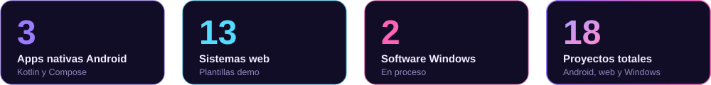

<br /><br />

<a name="apps"></a>
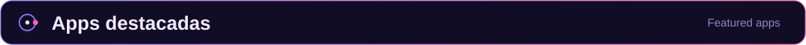

<br />

<p align="center">
  
  
  
</p>

<br />

<a name="web"></a>
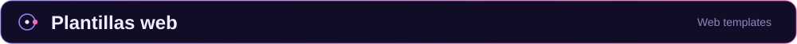

<br />

<p align="center">
  
  
  
</p>

13 demos repartidas en 3 constelaciones. Todas están marcadas como **Plantilla demo** en cards y modales. El mapa **Sistemas descubiertos** muestra solo proyectos web: Android y Windows viven en sus propias secciones.

<br />

<a name="windows"></a>
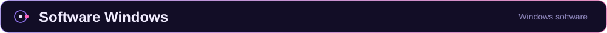

<br />

<p align="center">
  
  
</p>

Ambas llevan el badge **En proceso** mientras siguen en desarrollo activo.

<br />

<a name="colaboraciones"></a>
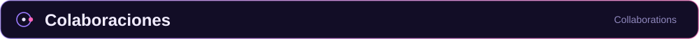

<br />

- **Felycan:** [clinicaveterinariafelycan.cl](https://clinicaveterinariafelycan.cl/), con captura local responsive generada desde `felycan.png`.
- El sitio de la clínica bloquea iframes mediante `frame-ancestors 'none'`, por lo que la vista previa usa imágenes **WebP** ligeras para cualquier conexión.
- Para actualizar las capturas, desde la raíz del proyecto:

```bash
node scripts/optimize-felycan.mjs
```

<br />

<a name="temas"></a>
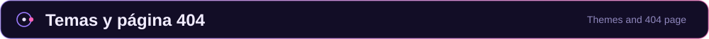

<br />

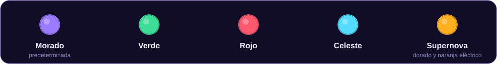

<br />

- **Selector de temas:** icono de pincel junto al idioma, con cinco paletas oscuras espaciales: Morado (predeterminada), Verde, Rojo, Celeste y Supernova (dorado y naranja eléctrico). La preferencia se guarda en `localStorage` bajo `space-theme` y se comparte con la página 404.
- **404 independiente:** `404.html` tiene su propia entrada React (`src/notfound.tsx`) y se genera en `dist/404.html`. `vercel.json` sirve los archivos existentes y responde con esta página y estado HTTP 404 para las rutas inexistentes. En desarrollo, la app también muestra la pantalla 404 para rutas desconocidas.
- La nueva sección, el selector y los mensajes de error están traducidos a ES / EN / PT / FR.

<br />

<a name="stack"></a>
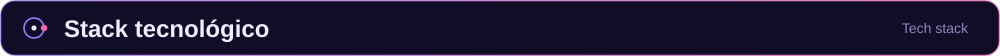

<br />

<table>
  <tr>
    <td width="150"><b>Frontend</b></td>
    <td>
      <br />
      
      
    </td>
  </tr>
  <tr>
    <td><b>Mobile</b></td>
    <td>
      <br />
      
      
      
      
    </td>
  </tr>
  <tr>
    <td><b>Backend</b></td>
    <td></td>
  </tr>
  <tr>
    <td><b>Base de datos</b></td>
    <td>
      <br />
      
      
    </td>
  </tr>
  <tr>
    <td><b>UI e íconos</b></td>
    <td>
      
      
      
    </td>
  </tr>
  <tr>
    <td><b>Rendimiento</b></td>
    <td>
      
      
      
    </td>
  </tr>
</table>

<br />

<a name="idiomas"></a>
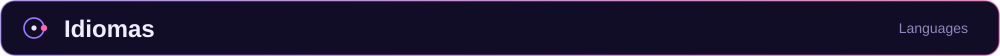

<br />

<div align="center">
  <table>
    <tr>
      <td align="center">🇪🇸<br /><b>Español</b><br /><code>es</code></td>
      <td align="center">🇺🇸<br /><b>English</b><br /><code>en</code></td>
      <td align="center">🇧🇷<br /><b>Português</b><br /><code>pt</code></td>
      <td align="center">🇫🇷<br /><b>Français</b><br /><code>fr</code></td>
    </tr>
  </table>
</div>

> **ES / EN / PT / FR 100 % traducido**, sin textos hardcodeados, mediante `t(lang, key)` en `src/lib/i18n.ts`.

<br />

<a name="features"></a>
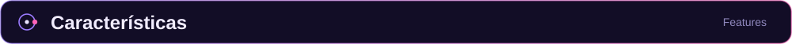

<br />

<table>
  <tr>
    <td width="33%" valign="top"><b>Hero multiplataforma</b><br />De "solo Kotlin" a "Kotlin + Web & Desktop".</td>
    <td width="33%" valign="top"><b>i18n completo</b><br />100 % traducido ES / EN / PT / FR, sin hardcodes, con <code>t(lang, key)</code>.</td>
    <td width="33%" valign="top"><b>Íconos Lucide</b><br />Reemplazo total de emojis por iconografía consistente.</td>
  </tr>
  <tr>
    <td valign="top"><b>Carga adaptativa</b><br /><code>navigator.connection</code> + medición manual: iframe si la conexión es rápida, WebP estático si es lenta.</td>
    <td valign="top"><b>Load More galáctico</b><br />6 iniciales, +6 por clic y contador <code>Mostrando X de Y</code>.</td>
    <td valign="top"><b>Badge Plantilla demo</b><br />Disclaimer profesional en cards y modales.</td>
  </tr>
</table>

<br />

Así decide el portafolio cómo mostrar cada vista previa:

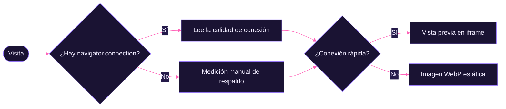

<br />

<a name="seo"></a>
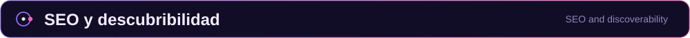

<br />

<details>
<summary><b>Ver qué se hizo para que Google encuentre el portafolio</b></summary>

<br />

- `title`, `description`, canonical y JSON-LD (`Person`) en `index.html`.
- OpenGraph + Twitter Card con imagen social 1200×630 (`public/og-image.png`).
- `robots.txt` + `sitemap.xml` registrados en Google Search Console.
- Páginas SEO estáticas para intención de búsqueda: `/servicios.html`, `/desarrollo-web-chile.html`, `/apps-android-kotlin-chile.html` y `/software-windows.html`.
- Contenido HTML inicial en la home para que Google lea servicios, experiencia real y FAQ incluso antes de renderizar React.
- JSON-LD adicional de servicios y FAQPage para reforzar búsquedas por desarrollo web, apps Android Kotlin y software Windows en Chile.

</details>

<br />

<a name="estructura"></a>
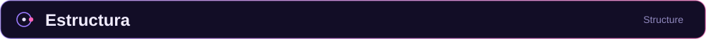

<br />

<details>
<summary><b>Ver el árbol de carpetas</b></summary>

```
MiPresentacion
 ┣ src/
 ┃ ┣ components/           → NebulaMap, OrbitCard, MobileShowcase, Hero, Skills...
 ┃ ┣ data/                 → projectsData.ts (18 proyectos)
 ┃ ┣ hooks/                → useConnectionQuality.ts (Network Info API + fallback)
 ┃ ┣ lib/                  → i18n.ts (4 idiomas), previewImages.ts
 ┃ ┗ App.tsx               → Hero multiplataforma + fondo galaxia
 ┣ public/                 → og-image, robots, sitemap, verificación GSC, images/
 ┣ vite.config.ts
 ┣ package.json
 ┗ README.md
```

</details>

<br />

<a name="ver"></a>
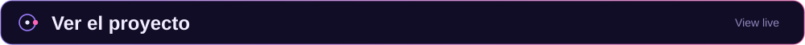

<br />

<div align="center">
  <a href="https://miportafolio-fguz.vercel.app/"></a>
</div>

<br />

```bash
# Desarrollo
npm run dev          # http://localhost:5173

# Build de producción
npm run build        # → dist/

# Vista previa del build
npm run preview
```

**Producción en Vercel:** <https://miportafolio-fguz.vercel.app/>, con deploy automático desde `main`.
Indexado en Google Search Console con sitemap e imagen social para compartir.

<br />

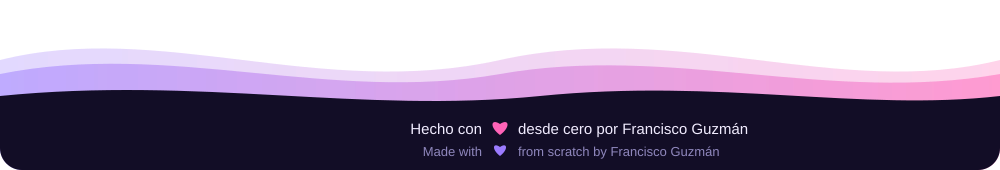
